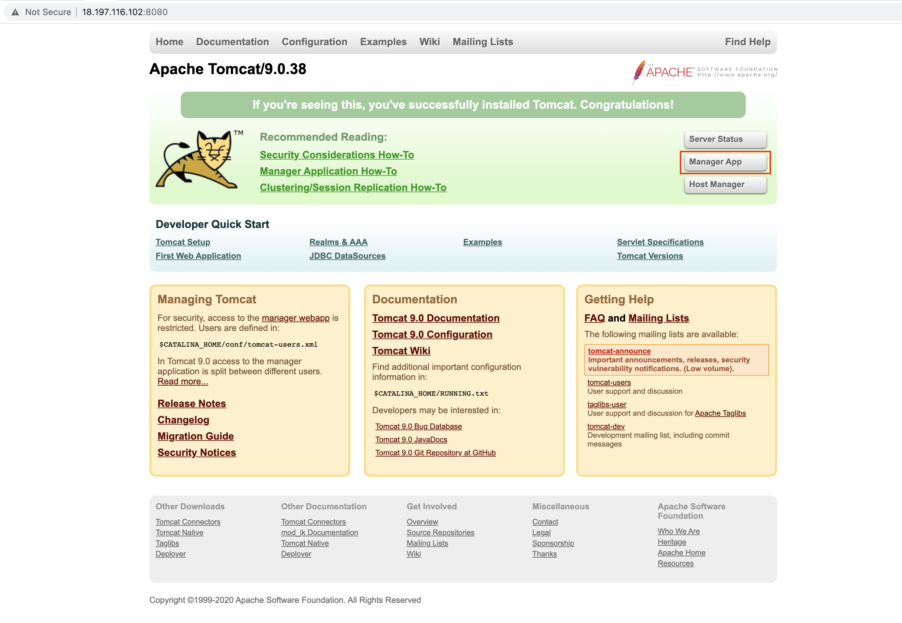

# Supercar Trader Readme

This is a simple Struts application which provides for an online supercar store which has some performance/code issues. The application can be built with Maven.

## Architecture

The application is based on a Struts front end deployed on Apache Tomcat, using a [MySQL](https://www.mysql.com) back end.  MySql 5.7 is recommended.

## Database

The app uses a MySQL DB in the backend, the default schema is expected to be the "supercars" schema, and MySQL running on the same host as the application. The database build scripts are in "src/main/resources/db"

There are three scripts you will need to run in order:

- mysql-01.sql
- mysql-02.sql
- mysql-03.sql

The datasouce is defined in context.xml in src/webapp/META-INF

## Setup

### Application Server Setup

1. Have [Git](https://git-scm.com) installed and working
	<pre><code>
	sudo yum install git
 	</code></pre>
1. Use Git to obtain the WAR File code
	<pre><code>
	sudo mkdir appdynamics
	sudo chown -R [your-user]:[your-user] /opt/appdynamics  (if you are not executing  as the root user)
	cd /opt/appdynamics
 	git clone https://github.com/Appdynamics/DevNet-Labs.git
 	</code></pre>
1. Install Java
	- Run the below (may change  based on your linux distribution)
		<pre><code>
 		sudo yum install java-1.8.0 (may vary based on your linux distro)
 		</code></pre>
	- Check the Java Version
		<pre><code>
 		java -version
		===OUTPUT===
		openjdk version "1.8.0_265"
		OpenJDK Runtime Environment (build 1.8.0_265-b01)
		OpenJDK 64-Bit Server VM (build 25.265-b01, mixed mode)
 		</code></pre>
1. Install Tomcat
	- We can download Apache tomcat 9 tar.gz either from its official Web site or using wget command from the terminal.
	- Install wget  command to  directly downlaod Tomcat on  our host fromt the internet
		<pre><code>
 		sudo yum install tomcat (may vary based on your linux distro)
 		</code></pre>
	- Then Install  TomCat  Admin Packages, mainly to install the default Tomcat root page (tomcat-webapps), and the Tomcat Web Application Manager and Virtual Host Manager (tomcat-admin-webapps)
		<pre><code>
 		sudo yum install tomcat-webapps tomcat-admin-webapps  (may vary based on your linux distro)
 		</code></pre>
1. Run Tomcat
	- By default no user or account is allowed to access Manager GUI Page and Admin Page. So to grant access to the users add the following lines in the file “/usr/share/tomcat/conf/tomcat-users.xml” at the end just above </tomcat-users> tag
		<pre><code>
		sudo vi /usr/share/tomcat/conf/tomcat-users.xml
		</code></pre>
		Then add the below just above </tomcat-users> tag to create a User Admin Who can access manager and admin section both
		<pre><code>
		&lt;!-- User linuxtechi who can access only manager section --&gt; 
		&lt;role rolename="manager-gui" /&gt; 
		&lt;user username="manager" password="password" roles="manager-gui" /&gt; 
		&lt;!-- User Admin Who can access manager and admin section both --&gt; 
		&lt;role rolename="admin-gui" />
		&lt;user username="admin" password="password" roles="admin-gui" /&gt; 
		</code></pre>
	- Start Tomcat
		<pre><code>
		sudo systemctl start tomcat
		</code></pre>
		And enable Tomcat to automatically start if the server is rebooted:
		<pre><code>
		sudo systemctl enable tomcat
		</code></pre>
	- Open Tomcat URL in the browser to verify its isntallation
		<pre><code>
		Go to http://{ip-address-or-Hostname}:8080/
		</code></pre>

### Application Deployment
1. Use the Tomcat Manager to deploy the war file
   - Go to Tomcat GUI at http://{ip-address-or-Hostname}:8080/
   - Click  on Manager App button on the right where  you'll be prompted to enter the Manager Credentails that we added in the “/usr/local/apache/apache-tomcat-7/conf/tomcat-users.xml” file  
   
   - To Deploy an Applicationn, You can either upload the WAR file through the Tomcat Manager web page or specify the path of the WAR file if it exists on Tomcat host
   - Since we've built our WAR file and it already  exists on the Server, we will use the second approach: 
   	- Scroll
		 - Scroll Down to the "Deploy directory or WAR file located on server" Section
		 - Contect Path: Defines the URL that end users will access the application from. So we will add "/Supercar-Trader" where our application can be accessed from a URL like http://{ip-address-or-Hostname}:8080/Supercar-Trader
		 - WAR or Directory Path: THe path of WAR file we generated from the Maven Build, which should be located at "/opt/appdynamics/DevNet-Labs/applications/Supercar-Trader/Supercar-Trader.war"
	-  Click  Deploy
	 
	
1. Now the app is available on "http://{ip-address-or-Hostname}:8080/Supercar-Trader" on your Tomcat instance

### Database Setup
1. Install MySQL 5.7 Community Version
	<pre><code>
	sudo yum install wget
	wget https://dev.mysql.com/get/mysql57-community-release-el7-9.noarch.rpm
	sudo rpm -ivh mysql57-community-release-el7-9.noarch.rpm
	sudo yum install mysql-server
 	</code></pre>
1. Start the Service  
	<pre><code>
	sudo systemctl start mysqld
 	</code></pre>
1. Verify the Service Status
	<pre><code>
	service mysqld status
	===OUTPUT===
	Redirecting to /bin/systemctl status mysqld.service
	● mysqld.service - MySQL Server
	   Loaded: loaded (/usr/lib/systemd/system/mysqld.service; enabled; vendor preset: disabled)
	   Active: active (running) since Mon 2020-09-28 13:02:28 UTC; 11s ago
	     Docs: man:mysqld(8)
		   http://dev.mysql.com/doc/refman/en/using-systemd.html
	  Process: 2742 ExecStart=/usr/sbin/mysqld --daemonize --pid-file=/var/run/mysqld/mysqld.pid $MYSQLD_OPTS (code=exited, status=0/SUCCESS)
	  Process: 2689 ExecStartPre=/usr/bin/mysqld_pre_systemd (code=exited, status=0/SUCCESS)
	 Main PID: 2745 (mysqld)
	   CGroup: /system.slice/mysqld.service
		   └─2745 /usr/sbin/mysqld --daemonize --pid-file=/var/run/mysqld/mysqld.pid
	Sep 28 13:02:20 ip-172-31-0-231.eu-central-1.compute.internal systemd[1]: Starting MySQL Server...
	Sep 28 13:02:28 ip-172-31-0-231.eu-central-1.compute.internal systemd[1]: Started MySQL Server.
 	</code></pre>
1. Secure MySQL
	-During the installation process, a temporary password is generated for the MySQL root user. Locate it in the mysqld.log with this command:
	<pre><code>
	sudo grep 'temporary password' /var/log/mysqld.log
 	</code></pre>
	Make note of the password, which you will need in the next step to secure the installation and where you will be forced to change it.
	-Execute the secure mysql installation tool
	<pre><code>
	mysql_secure_installation
 	</code></pre>
	Enter the following:
	<pre><code>
	New password: "p@ssW0rd1"
	Remove anonymous users? n
	Disallow root login remotely? n
	Remove test database and access to it? n
	Reload privilege tables now? y
	</code></pre>

### Database Deployment
	
