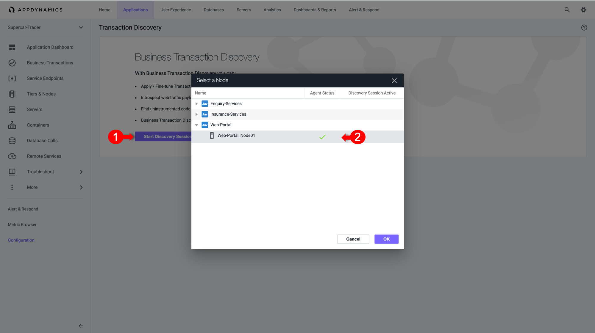

# Configure Method Invocation Data Collectors

Data collectors allow you to supplement business transaction and transaction analytics data with application data. The application data can add context to business transaction performance issues. For example, they show the values of particular parameters or return value for business transactions affected by poor performance. 
This data shows the business context affected by performance issues, such as the specific user, order, or product.  

Method invocation data collectors capture code data such as method arguments, variables, and return values.

In case HTTP Data Collectors don’t have sufficient business data, we can still capture these information from the Code execution

In this exercise you will perform the following tasks:
- Discover Methods
- Open a Discovery Session
- Discover Method Parameters
- Drill Down to an Object within the Code
- Create Method Invocation Data Collector
- Validate Analytics on Method Invocation Data Collectors

## Discover Methods

To  provide a business context  while monitoring our Application, We will discover the Business Data while Selling a Car, like Car Price, Model, etc..
Therefor we have first to identify the method within the Application Code that will most likely be containing this data

1. Open one of the **"/Supercar-Trader/sell.do" Transaction Snapshots** with Full Call Graph
2. **Drill into the Web-Portal** and Expand the Call Graph
3. You’ll notice a **“saveCar” method** being called which is responsible for taking the User Input and saving it to the Database


4. Right click on the method, and select **“View Details”**
5. Note down the **Full Class Name** and the **Method Name**
  ```
  Class Name: supercars.dataloader.CarDataLoader
  Method Name: saveCar
  ```


## Open a Discovery Session

After Identifying the Method that is responsible for the Save Car Operation, next step is to identify which parameters would hold the business data.

If we don’t have the assistance from an Application Developer to identify this from the source code, there is an approach to discover the Application Methods and Objects directly from AppDynamics.

1.	Select the **Applications** tab at the top left of the screen.
2.	Select **Supercar-Trader** Application
3.	Select the **Configuration** Left tab.
4.	Click on the **Instrumentation** Link.
5.	Select the **Transaction Detection** Tab.
6.	Click on the **Live Preview Button** on the Right
 
 
## Discover Method Parameters

1.	Click on **Start Discovery Session Tab** at the top right of the screen
2.	Select the **Web-Portal Node** in the Pop-up windows (It should be the same Node that the Method we are investigating runs on)


1.	Select Tools on the right toggle 

4.	Select Classes/Methods in the Drop Down List.
5.	Select Classes with name that contains in the Search for section.
6.	Type in the Class Name “supercars.dataloader.CarDataLoader” in the Text Box
7.	Click on Apply Button, to search for that Class Methods
8.	Once the Results Appear, Expand the Class matching your search
9.	Look for the same Method that we noted earlier which is “saveCar”


Note that the saveCar method takes a "CarForm" Object as an input parameter.


**Next**: Understand Dashboard Components
