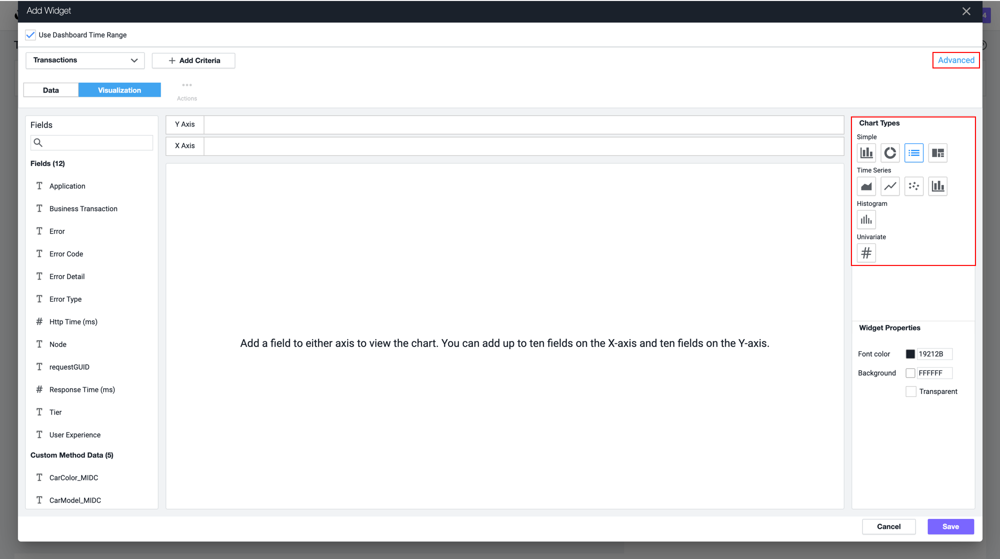
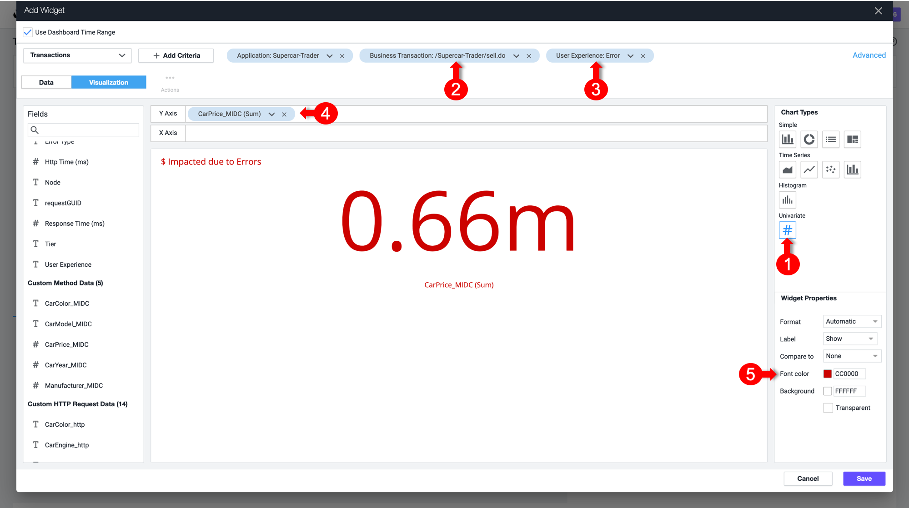
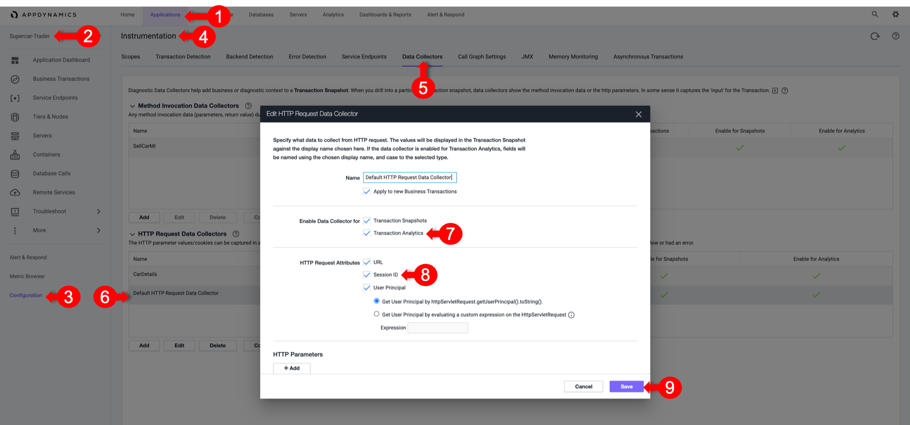
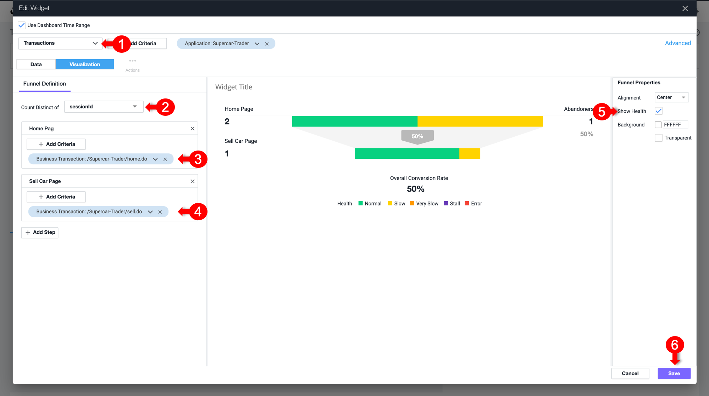

# Dashboard Components 

The ability to build dashboards is a vital skill to demonstrate and utilize AppDynamics Capabilities and Value. 
In this exercise, We will be working through a few of the Useful Dashboard Components that can be used to build compelling dashboards.

## Create a new Dashbaord
1. Select the **Dashbaord & Reports** tab at the top left of the screen.
2. Click on **Create Dashboard** Button
3. In the Popup Window, Type the Dashbaord Name
4. In the Popup Window, select **Absolute** as the **Canvas Type**
5. Click **Ok**

Now Open the newly created  empty  Dashboard and let's start adding various widget types.

## Dashboard Components: Custom Widget Builder
Benefits:
1.	Very Flexible
2.	Can generate, Numeric, Timeseries, Pie charts, etc.. 
3.	Based on AppDynamics "AD" Query Language 

Now, let's start Creating one
1. Toggle the **Edit Mode** at the upper left corner of the dashboard
2. Click on **Add Widget** Button
3. In the Popup Window, Select the **Analytics** Tab  on the left
4. Then Click on **Custom Widget Builder**

Once opened,  you'll notice that there are various type of Chart  Types that we can create in the Customer Widget Builder, and either by Drag or Drop, or by AD Query in the Advance pane, thus showing the Benefits discussed ealier.

For now, we will cover Numeric, Bar and Pie Charts.

### Numeric Type
 **Exercise:** Quantifying the $ Amount Impacted due to Errors is significant to every Application Owner, Where we can show the Customer how much his  IT have Impacted the business revnue and tthus resulting in money/profit loss
1. Select "Numeric" from the Chart Types on the right
2. Add a filter on the "/Supercar-Trader/sell.do" Business Transactions
3. Add a filter on the "Error" User Experience to show what was impacted due to Errors
4. Add “CarPrice_MIDC" in the Y-Axis, notice that SUM is the Aggregation used to capture the total Price per Model
5. Change  the Font Color to Red to better present it.
5. Click on Save

Note that we could do the same for the $ Amount Transacted Succesfully by changingn the User Experience filter to only include NORMAL, SLOW and VERY SLOW.

Bonus Point: We could baseline this Metric by Creating a Custom Metric in the Analytics Module, and defining a Health Rule to represent if the $ Amount Impacted is as expected or even  higher than the  norm (versus the Baseline).
Also it  will always be nice to add a Label for the Currency.

### Bar Charts Type
 **Exercise:** Visualizing Top Impacted Car Models, where we will have a Bar Chart, showing the Car Models of all of the SellCar Trasnactions, categorised by the User Experience
1.	Select "Bar" from the Chart Types on the right
2.	Add a filter on the "/Supercar-Trader/sell.do" Business Transactions
3.	Add “CarModel_MIDC" in the X-Axis
4.	Add “User Experience" in the X-Axis
5.	Click on Save

Bonus Point: This Chart Type Can be utilised based on your need, to group in the X-AXIS by Customer Type, Company, Organization or any other relevant grouping if exists, below  are  some inspirations

### Pie Charts Type
**Exercise:** Visualizing $ Sold by Car Models, where we will have a Pie Chart, showing the Car Models of all of the SellCar Trasnactions, and the sum of Prices per Model to know the most  Demanded Car Model on the Application, now that is defiently a Business View
1.	Select "Pie" from the Chart Types on the right
2.	Add a filter on the "/Supercar-Trader/sell.do" Business Transactions
3.	Add “CarModel_MIDC" in the X-Axis
4.	Add “CarPrice_MIDC" in the Y-Axis, notice that SUM is the Aggregation used to capture the total Price per Model
5.	Click on Save

**Bonus Point:** This Chart Type Can be utilised based on your need, below  are  some inspirations

## Dashboard Components: Conversion Funnels
Benefits:
1. Help visualize the flow of users or events through a multi step process in an application to better understand which steps can be optimized for more successful convergence. 
2. Tie the IT Perfomance of every Step through a funnel, to understand how it impacted the user experience and thus was the cause of Users Drop Offs

Note that the funnel is filtered by the Users who executed this path in that specific order, not the total visits per step.

The first step of Funnel Creation is to select a unique identifier of the Transaction that represents every User Navigation through the funnel, mostly the Session Id is the best representation, as The SessionID persists through each step in the funnel.

### Based on Transactions

Session Id can be captured from the Transactions (if not API based), therefore we'll need to have a Data Collector for the SessionId.
For Java Applications we can relay on AppDynamics Session Id capturing capability in the Default HTTP DataCollector, we'll make sure it  is enabled and apply it to all Business Tranasactions to make sure we apture the SessionId for every Transaction

1. Select **Transactions** from the Drop Down List
2. In the **Count Distinct of** Select **sessionId** from the Drop Down List
3. Click on **Add Step**, Name it **"Home Page"**, click on **Add Criteria**, select **Business Transactions**, and then select **/Supercar-Trader/home.do**
4. Click on **Add Step**, Name it **"SellCar Page"**, click on **Add Criteria**, select **Business Transactions**, and then select **/Supercar-Trader/sell.do**
5. Select the **Show Health** Checkbox on the left to visualise the Transactions Health in the Flow Map

### Based on Browser Sessions

Not covered in this course

