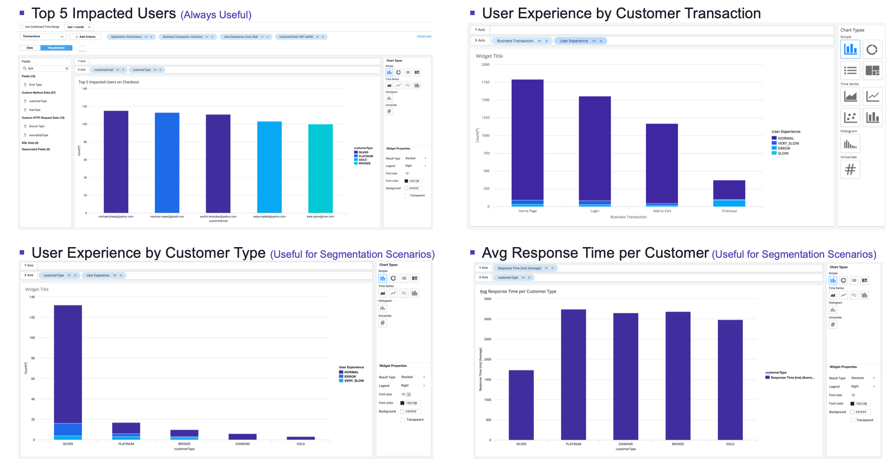
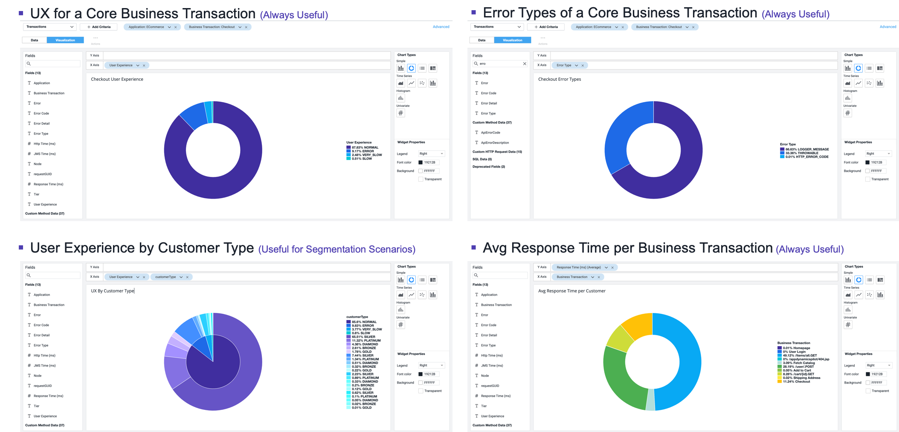
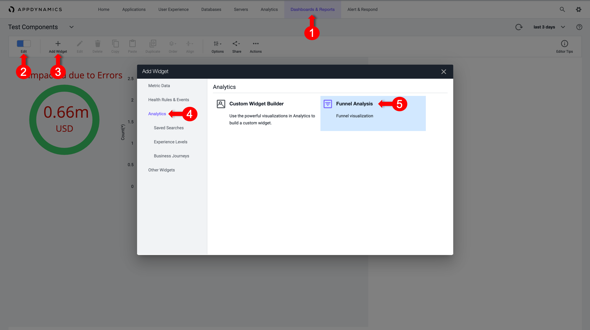
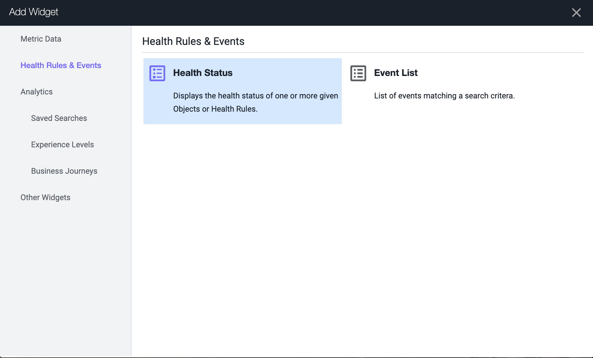
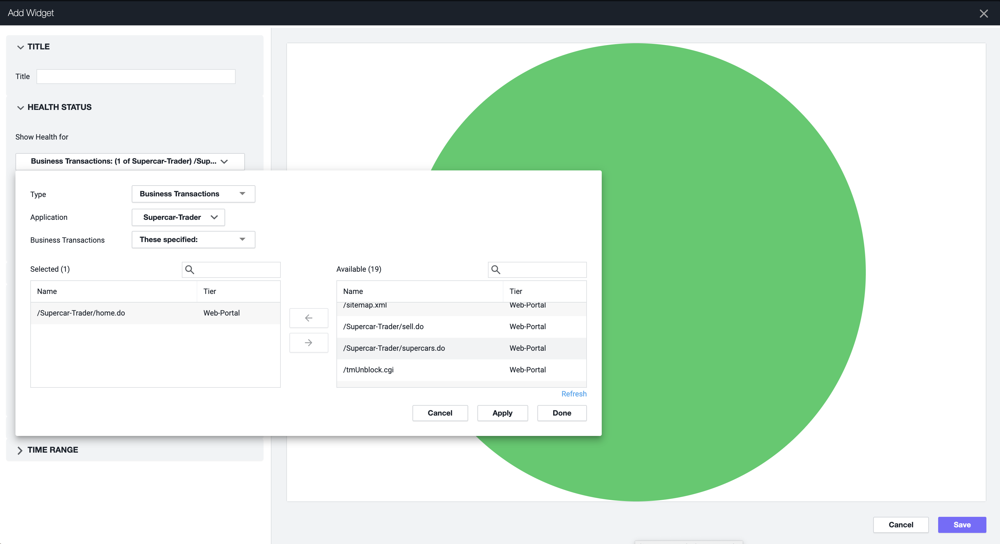
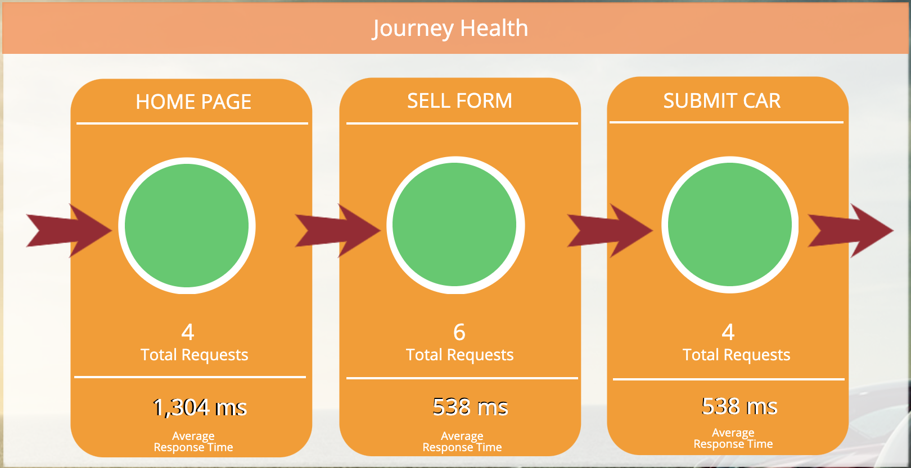

# Dashboard components

The ability to build dashboards is a vital component of the AppDynamics capabilities and value. In this exercise,you will work with some of the dashboard components that can be used to build compelling dashboards.

## Create a new dashboard

1. Select the **Dashboard & Reports** tab.
2. Click **Create Dashboard**.
3. Enter a dashboard name.
4. Select **Absolute** as the **Canvas Type**.
5. Click **OK**.

Now open the newly created empty dashboard. You will now add various widget types.

## Dashboard components custom widget builder

The custom widget builder is a highly flexible tool that can generate representations of data, including numeric vews, time series, pie charts, and more. It is based on the AppDynamics AD Query Language.

To create a widget, follow these steps:

1. Toggle the **Edit Mode** at the upper left corner of the dashboard.
2. Click **Add Widget**.
3. Select the **Analytics** tab on the left.
4. Click **Custom Widget Builder**.

There are many chart types that you can create in the Customer Widget Builder. You can simply drag or drop information or create an AD Query in the Advanced pane..

For now, we will cover Numeric, Bar and Pie Charts.

### Numeric charts

**Exercise:** Quantifying the dollar amount impacted by errors enables you to show the impact of IT performance on the business revenue.

1. Select the **Numeric** chart type.
2. Add a filter on the `/Supercar-Trader/sell.do` business transactions.
3. Add a filter on the `Error` user experience to show the impact of errors.
4. Add `CarPrice_MIDC` in the Y-Axis. Notice that SUM is the Aggregation used to capture the total price per model.
5. Change the font color to red for better visibility.
5. Click **Save**.

Note that you could do the same for the **$ Amount Transacted Successfully** criterion by changing the user experience filter to only include NORMAL, SLOW and VERY SLOW.

You could also baseline this metric by creating a custom metric in the Analytics module and defining a health rule that indicates if the **$ Amount Impacted** is equal to or higher than the baseline. You can also add a label for the currency.

### Bar charts
**Exercise:** You will now create a bar chart to visualize Top Impacted Car Models. The chart will show the car models of all of the `SellCar` transactions, categorized by the User Experience.

1. Select the **Bar** chart type.
2. Add a filter on the `/Supercar-Trader/sell.do` business transactions.
3. Add `CarModel_MIDC` and `User Experience` to the X-Axis.
4. Click **Save**.

This chart type can be adjusted based on your need. For example, you could group the X-AXIS by Customer Type, Company, Organization, and more. Refer to the following example.

### Pie charts

You will now create a pie chart that shows all the car models reported by the `sellCar` transaction and the sum of prices per model. This will show the most highly-demanded model in the application.

1. Select the **Pie** chart type.
2. Add a filter on the `/Supercar-Trader/sell.do` Business Transactions
3. Add `CarModel_MIDC` in the X-Axis
4. Add `CarPrice_MIDC` in the Y-Axis. Note that `SUM` is the aggregation used to capture the total price per model.
5. Click **Save**.

Refer to the following example for more uses of the pie chart widget.

## Dashboard components: Conversion funnels

Conversion funnels help visualize the flow of users or events through a multi-step process. This enables you better understand which steps can be optimized for more successful convergence. You can also use conversion funnels to examine the IT perfomance of every step, to understand how they impact the user experience and identify the cause of user drop-offs.

Note that the funnel is filtered according to the users who executed this path in that specific order, not the total visits per step.

The first step of funnel creation is to select a unique identifier of the transaction that can represent each user navigation through the funnel. Usually, the Session ID is the best choice, since it persists through each step in the funnel.

1. Toggle the **Edit Mode** at the upper left corner of the dashboard.
2. Click **Add Widget**.
3. InSelect the **Analytics** tab.
4. Click **Funnel Analysis**.

### Based on transactions

A Session ID can be captured from the transactions. You'll need a `SessionId` data collector to use it as a counter for the Funnel transactions.

For Java applications, AppDynamics has the capability to Session IDs in the default HTTP data collector. You'll ensure that it is enabled and apply it to all business transactions to capture the Session ID for every transaction.

1. Select the **Applications** tab.
2. Select **Supercar-Trader** Application.
3. Select the **Configuration** Left tab.
4. Click **Instrumentation**.
5. Select the **Data Collectors** tab.
6. Edit the **Default HTTP Request Request Data Collectors**.
7. Select **Transaction Analytics**.
7. Verify that **SessionID** is selected.
7. Click **Save**.

Now apply some load by navigating multiple times from the `/Supercar-Trader/home.do` page. Then, directly navigate to `/Supercar-Trader/sell.do` page on the application.

Return to the funnel analysis widget.

1. Select **Transactions** from the drop-down list.
2. Under **Count Distinct of**, select **sessionId** from the drop-down list.
3. Click **Add Step**. Name it `Home Page`.
4. Click on **Add Criteria**, select **Business Transactions**, and then select `/Supercar-Trader/home.do`.
5. Click **Add Step**. Name it `SellCar Page`.
6. Click on **Add Criteria**, select **Business Transactions**, and then select `/Supercar-Trader/sell.do`.
5. Select the **Show Health** Checkbox on the left to visualize the transaction health in the flow map.

### Based on Browser Sessions

Not covered in this course

## User Journeys

User Journeys Help us to understand each step health of a Critical Business Journey that the Users execute, to determine how healthy the Application is to perform the main intended functionality

Application Owners are the ones who set the requirements of what is the User Journey that is important to visualize, and explain what are the order of the Business  Transactions that are  Journey’s Steps 

To Create a User Journey:
1. The Journey is a Manual placement of the Business Transaction Health Status Widget in the right order of Execution

2. Create Business Transaction Health Status Widgets (Pie) for all the required Steps

3. Order the Health Status Widget per the requirements

4. Create Lines connecting the BTs Health Widgets as Transparent Images to Convoy the connection

**Next**: Exercise: Build your dashboard
